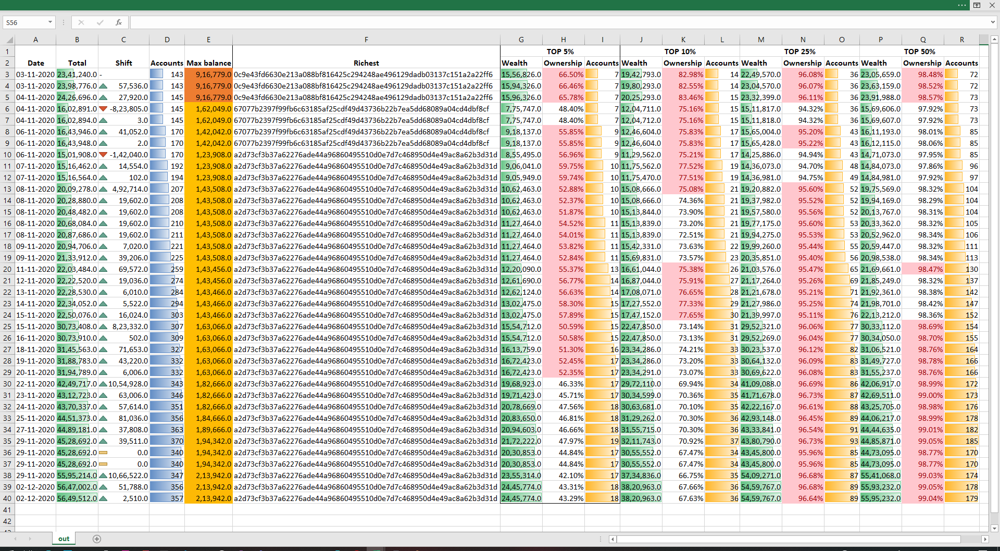
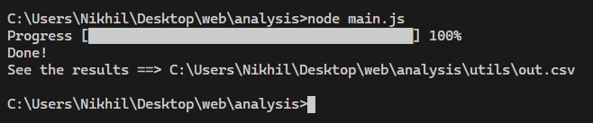

# Basic analytics for thenewboston!

Gain insights about thenewboston digital crypto currency network by doing some analysis. 

View the [Dataset used](https://github.com/thenewboston-developers/Account-Backups/tree/master/account_backups)

## Salient features

- Total coins distribution over time period
- Total number of accounts over time period
- Richest account information
- Wealth distribution between top 5%,10%, 25% and 50%
- Pre-processed Excel sheet

## Usage

1) First clone the repo
`git clone https://github.com/itsnikhil/tnb-analysis.git`

2) Go to analysis directory
`cd analysis`

3) Install dependancies
`npm install`

4) Execute the script
`node main.js`

## Advanced usage

Configuration can be tweaked under `constants.js`

|Param|Value|
|-|-|
|DIR|path to json data files|
|OUT_FILE_NAME|Output csv file name|
|ACCOUNTS_TO_SKIP|List of account numbers which can be skipped in pre-processing, used to remove outlier accounts (like treasury, payments accounts, etc)|

## Author

Nikhil Taneja (taneja.nikhil03@gmail.com)

https://itsnikhil.github.io/blog
